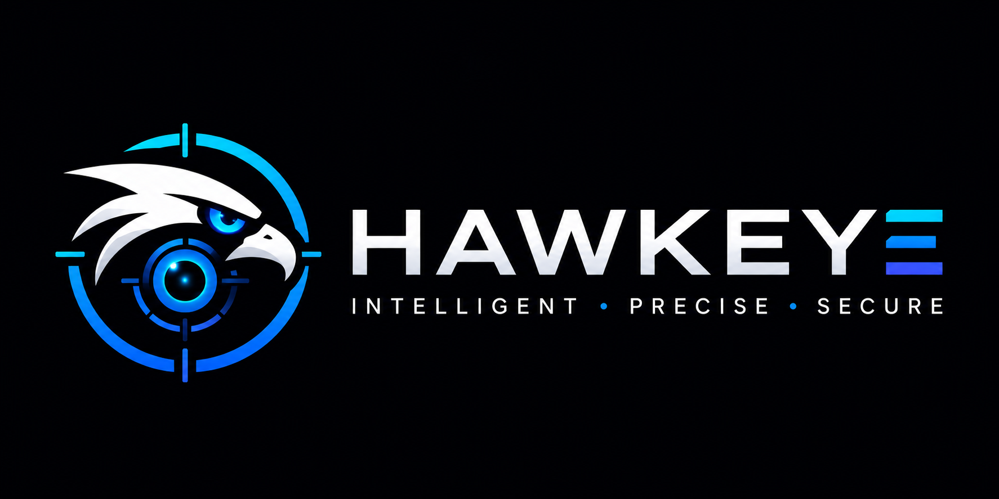
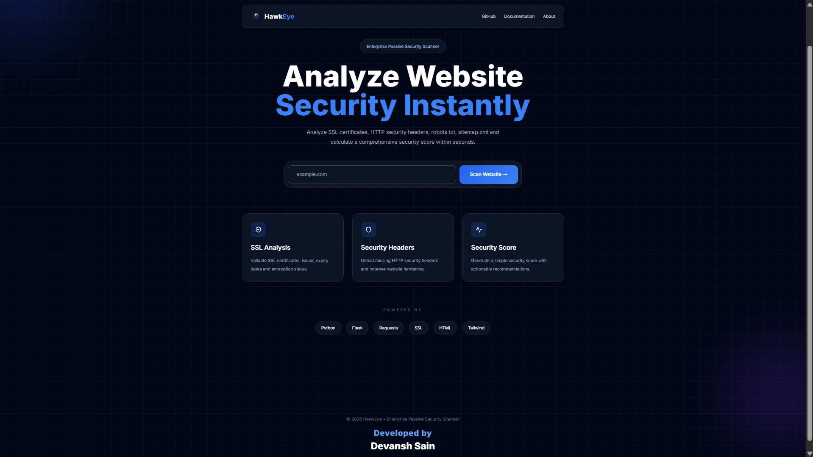
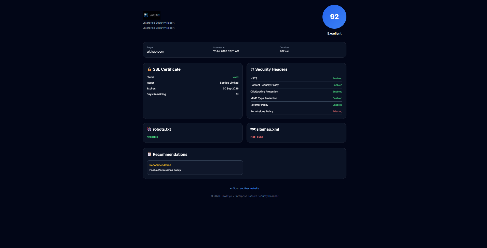

<div align="center">



# HawkEye

### Enterprise-Inspired Passive Website Security Scanner

Analyze a website's public security posture in seconds through passive reconnaissance techniques.

---

[](https://www.python.org/)
[](https://flask.palletsprojects.com/)
[](LICENSE)
[](https://github.com/Devanshsainn/HawkEye)

</div>

---

## Overview

HawkEye is a lightweight **Enterprise-Inspired Passive Website Security Scanner** built using **Python** and **Flask**.

Instead of performing intrusive penetration testing, HawkEye analyzes publicly accessible security configurations of websites to identify common security weaknesses and generate an easy-to-understand security report.

The project demonstrates practical cybersecurity concepts including SSL inspection, HTTP security header analysis, robots.txt discovery, sitemap detection, and security scoring.

---

# Features

- SSL Certificate Analysis
- HTTP Security Header Detection
- robots.txt Detection
- sitemap.xml Detection
- Domain Validation
- Security Score Calculation
- Security Recommendations
- Enterprise Dashboard UI
- Responsive Design
- Passive Security Analysis

---

# Screenshots

## Landing Page



---

## Results Dashboard



---

# Why HawkEye?

Modern websites expose valuable security information publicly.

HawkEye collects this information without exploiting the target and presents it in an easy-to-understand dashboard suitable for learning, demonstrations, and portfolio projects.

The scanner focuses on passive reconnaissance techniques and does **not** attempt exploitation or vulnerability attacks.
---

# Tech Stack

| Category | Technology |
|----------|------------|
| Backend | Python, Flask |
| Frontend | HTML5, CSS3, JavaScript |
| Styling | Tailwind CSS |
| Networking | Requests, Socket, SSL |
| Security | HTTP Security Headers, SSL/TLS |
| Version Control | Git & GitHub |

---

# Project Structure

```text
HawkEye/
│
├── app/
│   ├── routes/
│   │   ├── home.py
│   │   └── scan.py
│   │
│   ├── services/
│   │   ├── validator.py
│   │   ├── ssl_checker.py
│   │   ├── headers_checker.py
│   │   ├── robots_checker.py
│   │   ├── sitemap_checker.py
│   │   └── risk_engine.py
│   │
│   ├── static/
│   │   ├── css/
│   │   ├── js/
│   │   └── images/
│   │
│   └── templates/
│       ├── index.html
│       └── results.html
│
├── screenshots/
├── tests/
├── docs/
│
├── run.py
├── config.py
├── requirements.txt
├── LICENSE
└── README.md
```

---

# Architecture

```text
                 User
                   │
                   ▼
          Flask Web Interface
                   │
         ┌─────────┴─────────┐
         │                   │
         ▼                   ▼
   Input Validation     Scan Request
                             │
     ┌───────────────────────┼────────────────────────┐
     ▼                       ▼                        ▼
SSL Checker          Header Checker          robots/sitemap
     │                       │                        │
     └──────────────┬────────┴──────────────┬─────────┘
                    ▼
              Risk Engine
                    │
                    ▼
          Security Report Dashboard
```

---

# Installation

Clone the repository

```bash
git clone https://github.com/Devanshsainn/HawkEye.git
```

Move into the project

```bash
cd HawkEye
```

Create a virtual environment

```bash
python -m venv venv
```

Activate the virtual environment

### Windows

```bash
venv\Scripts\activate
```

### Linux / macOS

```bash
source venv/bin/activate
```

Install dependencies

```bash
pip install -r requirements.txt
```

Run HawkEye

```bash
python run.py
```

Open your browser

```text
http://127.0.0.1:5000
```

---

# Usage

1. Enter a website domain.

Example

```text
google.com
```

2. Click **Scan Website**.

3. HawkEye performs passive security checks.

4. Review the generated report including:

- SSL Certificate
- HTTP Security Headers
- robots.txt
- sitemap.xml
- Security Score
- Recommendations

---

# Security Checks Performed

| Check | Description |
|-------|-------------|
| SSL Certificate | Verifies certificate validity and expiry |
| HTTP Headers | Detects missing security headers |
| robots.txt | Checks for robots.txt availability |
| sitemap.xml | Detects sitemap presence |
| Security Score | Calculates an overall security score |
| Recommendations | Suggests improvements based on findings |
---

# Future Roadmap

The following features are planned for future releases of HawkEye:

- PDF Report Export
- DNS Information Lookup
- WHOIS Lookup
- TLS Version Detection
- Security Header Explanations
- Historical Scan Reports
- Live Deployment
- OWASP-based Security Checks
- API Support
- Dark / Light Theme Toggle

---

# Disclaimer

HawkEye is an educational and portfolio project.

It performs **passive security analysis only** by collecting publicly accessible information from websites.

It **does not** perform penetration testing, exploitation, vulnerability attacks, or any intrusive security testing.

Always ensure you have permission before assessing systems you do not own.

---

# Contributing

Contributions, feature requests, and suggestions are welcome.

If you'd like to improve HawkEye:

1. Fork the repository.
2. Create a feature branch.
3. Commit your changes.
4. Open a Pull Request.

---

# Developer

<div align="center">

## 👨‍💻 Devansh Sain

Cybersecurity Enthusiast • Software Developer • DevOps Learner

<p>

<a href="https://github.com/Devanshsainn">

</a>

<a href="https://www.linkedin.com/in/devanshsain">

</a>

</p>

</div>

---

# License

This project is licensed under the **MIT License**.

See the [LICENSE](LICENSE) file for more information.

---

# Acknowledgements

Special thanks to the open-source community and the developers behind:

- Python
- Flask
- Tailwind CSS
- Requests
- Lucide Icons
- GitHub

---

<div align="center">

## ⭐ If you found this project useful, consider giving it a Star!

It helps others discover the project and motivates future improvements.

<br><br>

**Built by Devansh Sain**

</div>